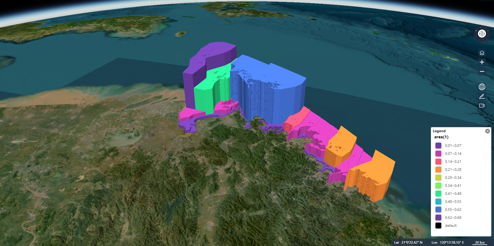
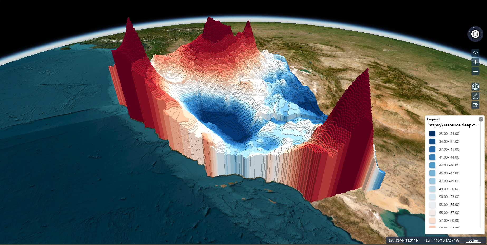
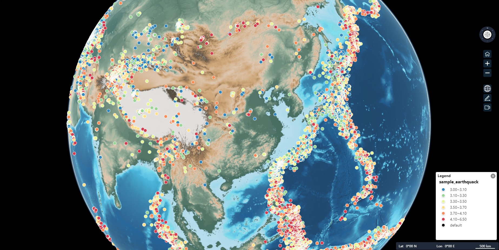
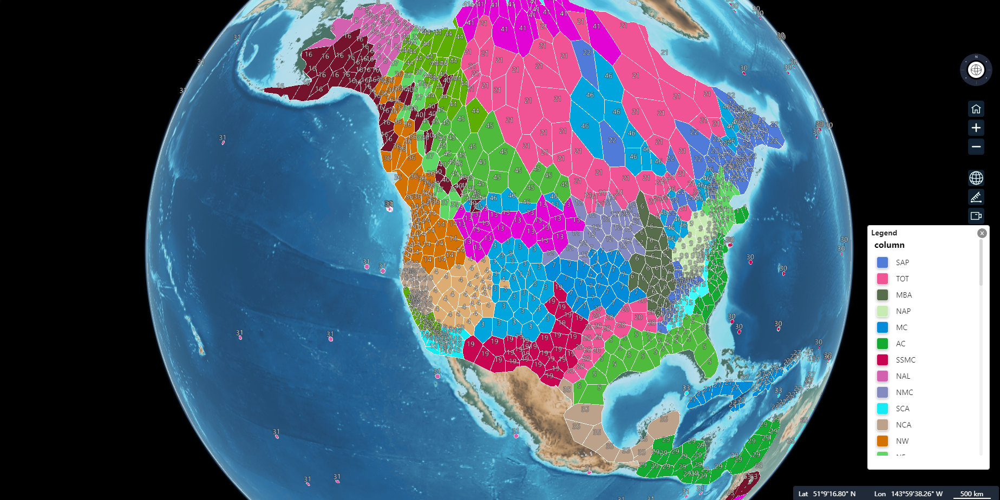

 

cesium-extends 是一个从[DDE-Earth](https://alpha.deep-time.org/map/#/)中抽离的、用于 CesiumJS 的扩展库，它与前端框架无关，提供了一些常用的功能和组件，方便开发者快速构建 Cesium 应用。

## 安装

使用 npm 安装：

```bash
npm install cesium-extends --save
```

## 功能

cesium-extends 提供了以下功能：

- 测量工具 `@cesium-extends/measure`
- 鹰眼图 `@cesium-extends/over-viewer`
- 控件工具 `@cesium-extends/control`
- ...

详细信息及 demo，请参阅 [API 文档](https://cesium-extends.vercel.app/)。

## 示例

<table>
  <tr>
    <td></td>
    <td></td>
  </tr>
  <tr>
    <td></td>
    <td></td>
  </tr>
</table>

## License

This project is licensed under the MIT License - see the [LICENSE](LICENSE) file for details.
